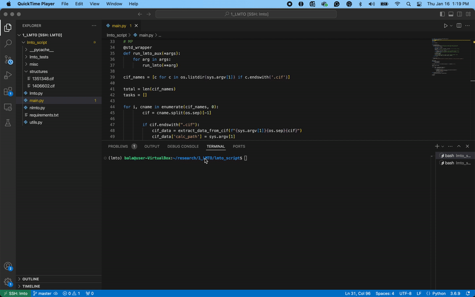

# High-throughput LMTO

[](https://github.com/balaranjan/High-throughput-LMTO/blob/main/LICENSE)


This is a package to automate the steps involved in performing LMTO calculations. The code will take a list of .cif files as input and for each structure in the list, an LMTO calculation will be performed including optimization, band structure calculation, and density of states calculation (DOS). The outputs from band structure, DOS, and COHP calculations are saved as comma-separated (.csv) files their plots are saved as png files.

Outputs can be visualized using the following [plotter package](https://github.com/EmilJaffal/High-throughput-LMTO-plotter).

> The current README.md serves as a tutorial and documentation - last update June 20, 2025

## Demo



## Getting started

Here is a quick tutorial on how to locally install the package.

## How to install `htlmto` locally

`cd` into the project directory:

```bash
cd High-throughput-LMTO
```

Create and activate a new conda environment:

```bash
conda create -n lmto_env python=3.13
conda activate lmto_env
```

### Install your package with dependencies sourced from pip

The package requires TB-LMTO program installed and its path added to the system's PATH variable.

It's simple. The only command required is the following:

```bash
pip install -e .
```

### Install TB-LMTO-ASA and `htlmto` via docker container

If you have the lmto source code (not shared in this repository) and want to setup a docker container, you may use the provided docker file.

Note: This setup works on x86_64 and known to fail in systems with Apple Silicon.

To setup the docker container,

1. Install docker, if you haven't already
2. Clone or download this repository
3. In a terminal window, `cd` into `High-throughput-LMTO`
4. Copy the TB-LMTO-ASA source code (in `.tar.gz` archive format) and rename it as `source.tar.gz`
5. Type `docker build -t YOUR_CONTAINER_NAME .`
6. To share files between your host (the computer where container is installed) and the container, make a directory
7. To launch the container with file sharing, type `docker run --user lmto --cpus=2.0 -it --mount type=bind,source=/path/to/directory_created_in_step_6,target=/home/lmto/lmto_calculations YOUR_CONTAINER_NAME`
8. (Optional) create an alias (`alias lmto="docker run --user lmto --cpus=2.0 -it --mount type=bind,source=/path/to/directory_created_in_step_6,target=/home/lmto/lmto_calculations YOUR_CONTAINER_NAME"`) in your `.bashrc` or `.bash_profile` file to launch the container.

## Verify your package has been installed

Verify the installation:

```bash
pip list
```

## Run

To get help, type

```
htlmto -h

usage: htlmto [-h] [-n ] [--force-O2] input_path

        A High Throughput LMTO Calculator.

        This code automates the LMTO calculations using TB-LMTO program.


positional arguments:
  input_path        Path to the input file / folder

options:
  -h, --help        show this help message and exit
  -n, --num-cores   Number of CPU cores to use.                         Default is 2.
  --force-O2        Force origin choice 2

```

To run, type

```
htlmto my_structure.cif
```

or

```
htlmto my_directory_with_multiple_cifs
```

### Origin Choice
The origin choice can be changed by either editing the cif
<br/>
change `_space_group_name_H-M_alt                'F d -3 m'` to `_space_group_name_H-M_alt                'F d -3 m (origin choice 2)'`
<br/>
or use the `--force-O2` flag (this does not change the basis).


### What `htlmto` does?

It performs the following steps:

1. Write the INIT file and run lminit.run to initialize CTRL and CBAK files.
2. Run lmhart.run and get the VOLSPH_by_VOL
3. If VOLSPH_by_VOL less than 100.0, then run lmes.run and lmovl.run iteratively.
   At each iteration check the output of lmovl.run for errors, get recommended
   changes (for RMAXS and OMMAX) based on the messages in the output file, and modify parameters in
   the CTRL file accordingly.
4. Run lmstr.run, check for recommended action in the output file if
   the run failed. Make the changes (for RMAXS and OMMAX) in CTRL file and run iteratively
   until lmstr.run finishes without errors.
5. Run lm.run until it converges.
6. Modify the number of KPOINTS (currently doubles) and optimize.
7. Perform band structure calculation.
8. Perform DOS calculation and extract total DOS and partial DOS for each element in the system.
9. Perform COHP calculation using interaction distances calculated using coordination environments and save element-element interactions.
10. Make plots for DOS, COHP, and band structure.

### For Hf, Lanthanides, and Actinides

- All lanthanides are substituted with La and their 4f orbitals are downfolded.
- All actinides are substituted with Th and and their 5f orbitals are downfolded.
- Hf is replaced with Zr.

## Contributors

- [Balaranjan Selvaratnam](https://github.com/balaranjan)
- Anton Oliynyk
- [Emil Jaffal](https://github.com/EmilJaffal)
- [Sangjoon Bob Lee](https://github.com/bobleesj)

## How to ask for help

- If you have any issues or questions, please feel free to reach out or
  [leave an issue](https://github.com/balaranjan/High-throughput-LMTO/issues).
